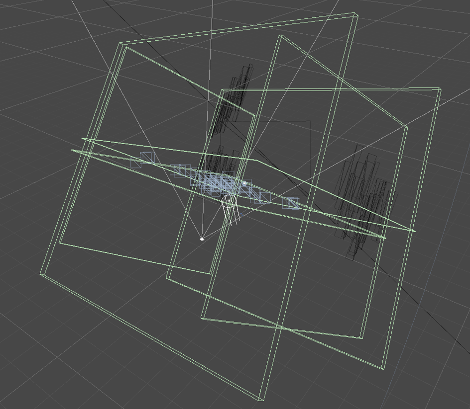

Have you ever tired to use particle system as a collider?
let's say you should make a lot of bubbles,  **here are the requests from a game designer**.

### interactable bubble
1. when user clicks on bubble, it should disappear 
2. every ** 50~60 seconds**, all the bubbles **in** the scene (the active particels) should disappear. 
3.when they disappear, the subemitter should be activated as well. 


**let's tackle the first issue** .
if you're not very familiar with difference between Shuriken's 's collider and normal collider(box,sphere collider.. **that are usually found in component option**) **you might turn on the collision checkbox of sheriken box and try to intergrate this function with a script.**


**unfortunately, it's not feasiblle**. even though the shreiken's collision system looks similar to the standard collider component, **it's not straightforward to directly access to the API of shreiken's collision to get some parameters** (e.g. most of the time we get OnTriggerExit, OnTriggerEnter..and so like to get the timing to control.)


maybe there are more efficient way to implement these fucntion, but i'd like to show you how i did it.


Firstly, i made bubble particles and turned on the collision option in the Shuriken  editor. you can see in the picture i sandwitched it between colliders to limit the area where the bubbles can move. this is important because not only they look visually stable(**of course it can be changed based on game system design**) but also helps to control the particles. you are going to understand this when you see the **code below.** 

**let's revisit the first request**, we should make the bubbles disappear when they are clicked. however, we can't easily detect the timing that the colliders attatched on particles are clicked on because we don't have the same API as collision enter or.. whatever. Moreover, we can't cast ray onto these colliders.**In other words**, apparently, they are basicially different. so we should find another solution. and here's the code!

```
  private void RemoveClosestParticle(Vector3 position)
    {
        var closestDistance = float.MaxValue;
        ParticleSystem closestParticleSystem = null;
        var closestParticleIndex = -1;

        foreach (var ps in particleSystems)
        {
            var (index, distance) = FindClosestParticle(position, ps);

          
            if (distance < closestDistance)
            {
               
                closestDistance = distance;
                closestParticleSystem = ps;
                closestParticleIndex = index;
            }
        }

        // remove the closest particle
        if (closestParticleSystem != null && closestParticleIndex != -1 && closestDistance < clickRadius)
        {
            var particles = new ParticleSystem.Particle[closestParticleSystem.particleCount];
            closestParticleSystem.GetParticles(particles);

            particles[closestParticleIndex].remainingLifetime = 0; // killing particle

            closestParticleSystem.SetParticles(particles, particles.Length);
        }
    }
    private (int, float) FindClosestParticle(Vector3 position, ParticleSystem particleSystem)
    {
        var particles = new ParticleSystem.Particle[particleSystem.particleCount];
        var particleCount = particleSystem.GetParticles(particles);

        closestDistance = float.MaxValue;
        closestIndex = -1;

        for (var i = 0; i < particleCount; i++)
        {
            var distance = Vector3.Distance(position, particles[i].position);
            if (distance < closestDistance)
            {
                closestDistance = distance;
                closestIndex = i;
            }
        }

        return (closestIndex, closestDistance);
    }```


Fortunately this time, instead of collision and raycast, we can get into the particle's position and how many particles the particle system has in a run time. so i made it work by combining this particle system with just normal plane collider to use raycast.

the code is quite simple, there only two methods. one is for removing the closest particle another one is for calculating the distance to **determine**  which particle is the closest to the user-clicked point.  

When you visualize this with a gizmo for debugging, it looks like this:


The blue line is the ray and the magenta sphere represents the position and the detectable range for user clicks on particles. When particles fall within the magenta sphere, they will be removed. **This function visually mimics what you would achieve if you created a similar system without a particle system, using just normal sphere GameObjects.**